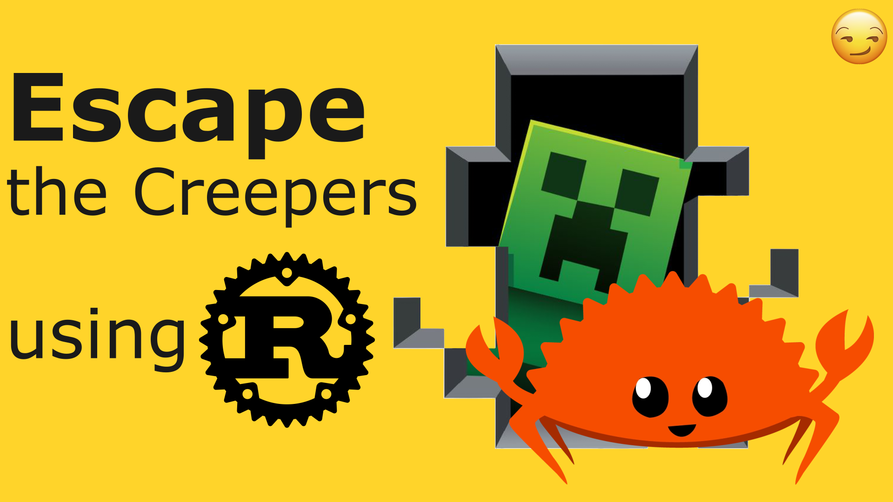

# Escape The Creepers
<p align="center">
  
</p>


# How to run
```
trunk serve
```

# Prerequisites

1. Install rust, cargo and friends. Please watch this video for more details: https://youtu.be/nnuaiW1OhjA
https://doc.rust-lang.org/cargo/getting-started/installation.html

2. Install trunk and `target add wasm32-unknown-unknown` please watch this video for more details: https://youtu.be/In09Lgqxp6Y
```
cargo install --locked trunk
target add wasm32-unknown-unknown
```

3. Install cargo watch 
```
cargo install cargo-watch
```
